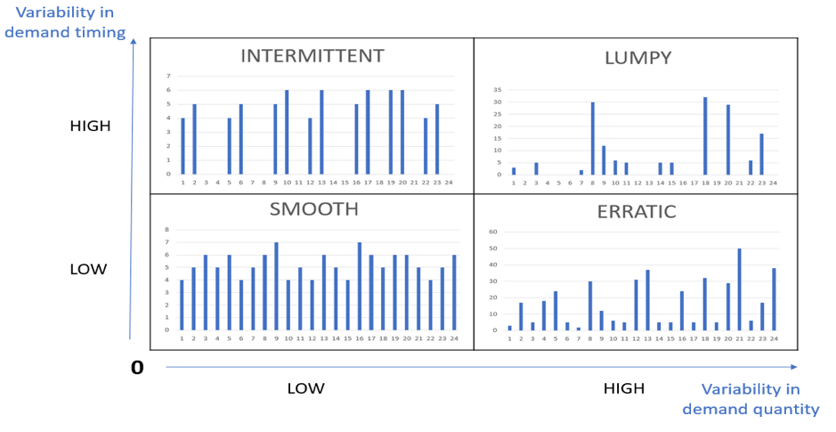

# time-series-forecasting
An implementation of generalized time series forecasting models

## Inputs
- List
- DataFrame with one column as Date (missing date imputation : 0)
- Prediction Interval

## Quad Classification
Before anything else, time series is classified based on [ADI](https://frepple.com/blog/demand-classification/) and [CV2](https://frepple.com/blog/demand-classification/). This helps in applying relevant models to the category of the time series 
#### Demand Categorization

#### Threshold values
`ADI: 1.33`, `CV2: 0.49`

## Models
- MA (Base Model)
- Exponential Smoothing (Base Model)
- SMART Willemain
- ARIMA
- Cronston
### Probabilistic Models
- State Space (Higher Order Markov Model) with ES
- Logistic Regression with ES
- AASVM - Adaptive Autoregressive Support Vector Machine

## Error Metric
- AAD - Average Absolute Deviation
- RMSE - Root Mean Squared Error
- MAPE - Mean Absolute Percentage Error
- MAAPE - Mean Arctangent Absolute Percentage Error
